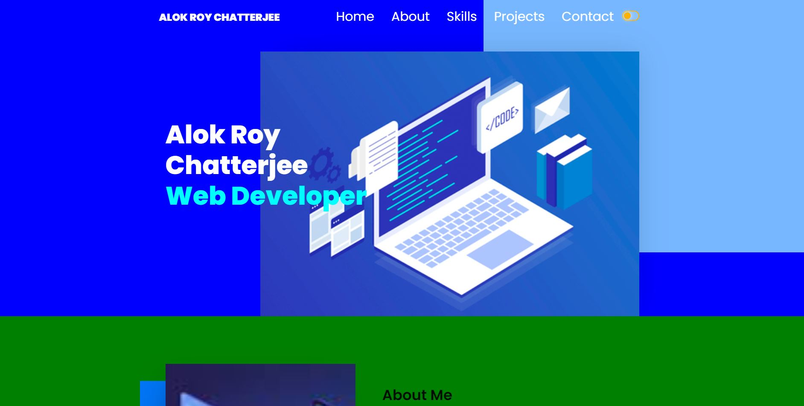
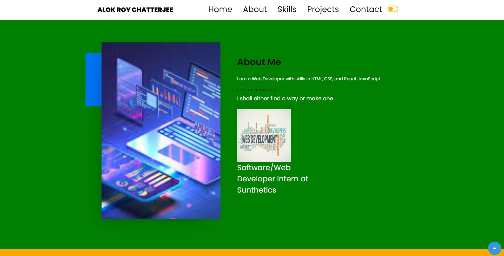
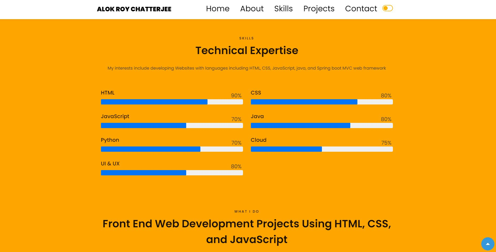
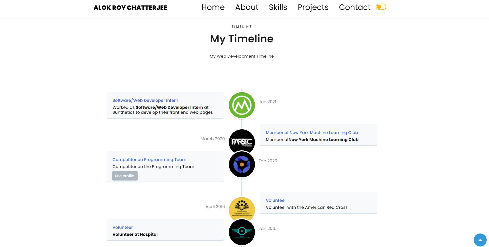
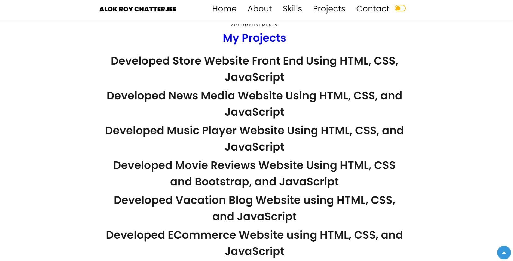
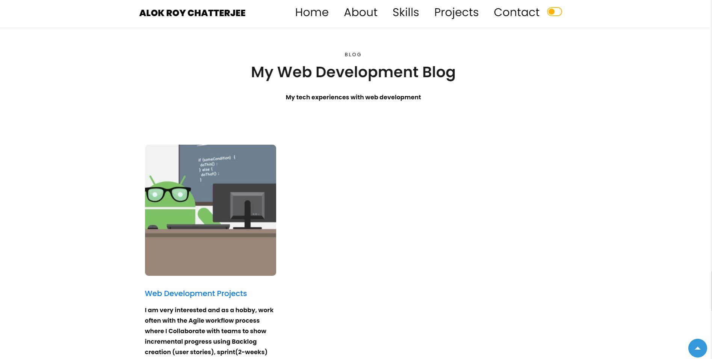
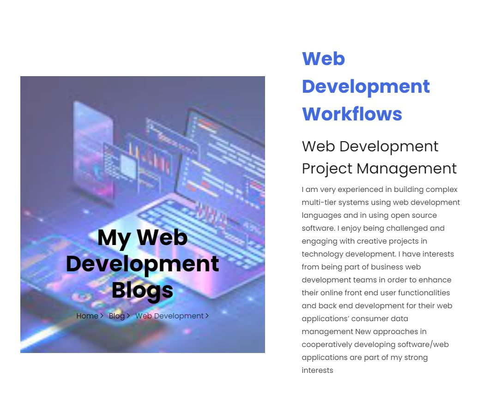
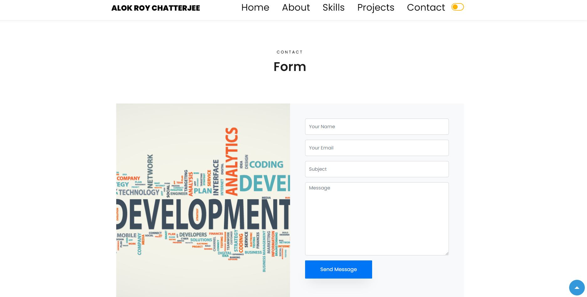

### Developed Personal Portfolio Website Using HTML, CSS, and JavaScript ###
### Sample Website Images are shown below and in .jpg files above
### This portfolio website has an about section that shows my description as a web developer ###
### A skills section with progress bars showing how much I know about different programming languages ###
### A projects section that shows my projects and certifications 
### A blog section that shows information about my experiences with technology development and agile workflow ###
### A timeline section showing my different projects 
### A contact section that includes a form to input user information

